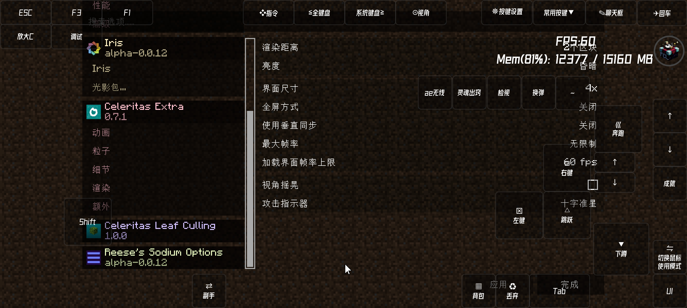

# Celeritas Leaf Culling

**Fork of SodiumLeafCulling for Minecraft 1.12.2, now adapted for Actinium (Actinium-compatible).**

This mod enables the Celeritas/Fast Block Renderer leaf culling to reduce unnecessary leaf rendering, improving FPS and reducing GPU load with virtually no visual impact. Ideal for large modpacks and low-end hardware.

> **Note:** This build targets [**Actinium**](https://github.com/Q-Engineering-Source/Actinium) as its dependency (replacing the original Celeritas requirement). Make sure [**Actinium**](https://github.com/Q-Engineering-Source/Actinium) is installed. Compatible with Cleanroom.

---

## Culling Methods

There are 3 culling methods:

- **Hollow** - behaves like Optifine's smart option. Gives best performance, looks worst out of all options.
- **Solid aggressive** - replaces leaves that are fully surrounded horizontally (north, south, east, west) but ignores vertical neighbors. Better performance than Solid but looks worse.
- **Solid** - replaces leaves fully surrounded on all six sides (up, down, north, south, east, west) with a solid block. Looks best out of all options, almost visually equal to Vanilla fancy option.

## Compatibility

Tested in a **Cleanroom** environment with **Actinium**: the mod's video settings interface displays correctly, so the leaf culling options can be configured as expected.

## Requirements

- Minecraft **1.12.2**
- [Cleanroom Loader](https://github.com/CleanroomMC/Cleanroom) 0.6.10-alpha or newer
- [Actinium](https://github.com/Q-Engineering-Source/Actinium) 2.4.0 or newer (required dependency)

### Optional dependency

- [AssetMover](https://github.com/CleanroomMC/AssetMover) 2.5 or newer

## Authors

- **Karnatour** (original 1.12.2 fork)
- **dspqle** (Actinium adaptation)

## Special Thanks

- **Txni (Toni)** - for the original SodiumLeafCulling
- **Embeddedt** - for creating Celeritas
- **Actinium team** - for the rendering backend this build targets

## License

See [LICENSE](LICENSE). This is a fork; original authorship credit is preserved.
